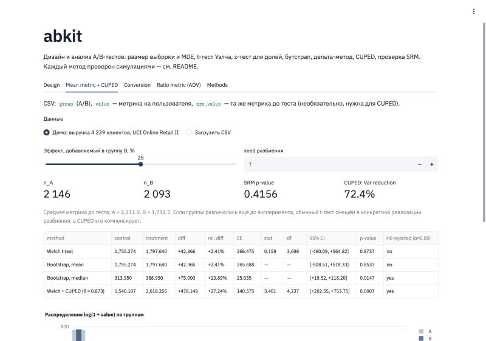
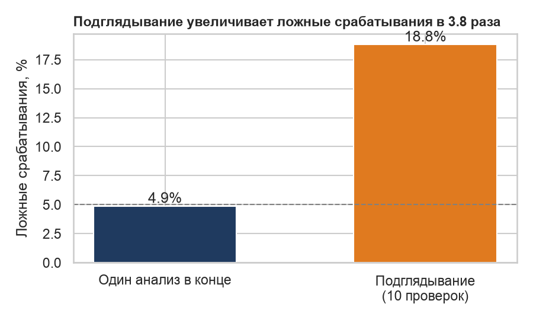
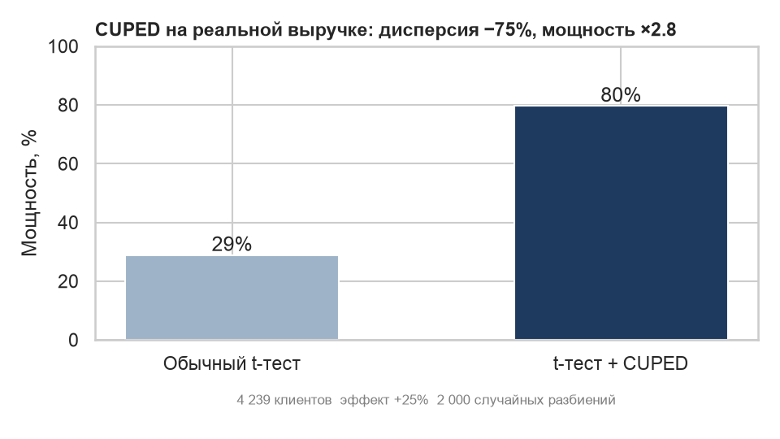
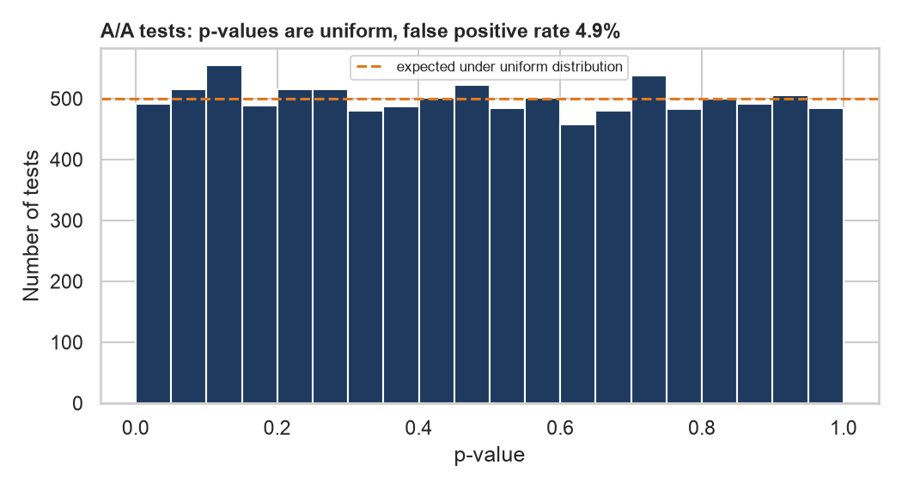
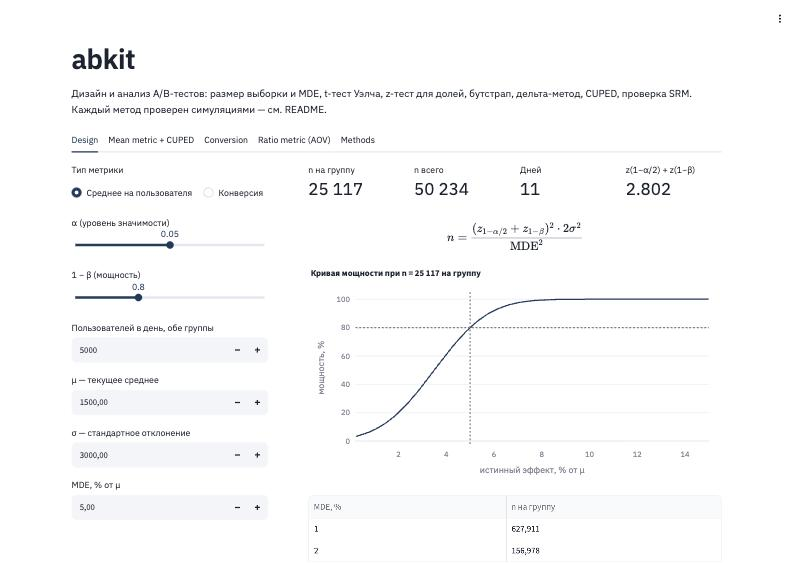

# abkit — дизайн и анализ A/B-тестов

Python-библиотека и Streamlit-приложение: размер выборки и MDE, t-тест Уэлча, z-тест для долей, бутстрап, дельта-метод для метрик-отношений, CUPED, проверка SRM. Корректность методов проверена симуляциями (A/A-тесты, мощность, peeking), CUPED — также на выручке 4 239 клиентов из UCI Online Retail II.

**Стек:** Python · NumPy · SciPy · pandas · Streamlit · Plotly · pytest



---

## Результаты проверки

| Проверка | Результат | Интерпретация |
|---|---|---|
| 10 000 A/A-тестов | ложных срабатываний **4,9%** (95% ДИ 4,5–5,3%) | t-тест Уэлча держит заявленный α = 5% даже на логнормальной выручке |
| Мощность при расчётном n | **78%** при плане 80% | формула размера выборки работает; небольшое расхождение — следствие тяжёлого хвоста распределения |
| Подглядывание (10 проверок) | ложных срабатываний **18,8%** вместо 5% | остановка теста при первом p < 0,05 почти в 4 раза увеличивает риск ложного вывода |
| Средний чек: t-тест по заказам | ложных срабатываний **27,9%** | заказы одного клиента зависимы — наивный тест сильно ошибается |
| Средний чек: дельта-метод | ложных срабатываний **4,7%** | корректная оценка дисперсии метрики-отношения |
| CUPED на реальных данных | дисперсия **−75%**, MDE **44% → 22%**, мощность **29% → 80%** | эквивалентно увеличению выборки в 4 раза без единого нового клиента |

### Подглядывание



### CUPED на реальной выручке

Метрика — выручка клиента за дек 2010 — ноя 2011, ковариата — его выручка за предыдущие 12 месяцев (корреляция 0,87). 2 000 случайных разбиений клиентов на группы, в группу B добавлен эффект +25%.



**Отдельная реализация разбиения (seed = 7, скриншот выше).** Средняя выручка до теста в группах различается случайно: £2 212 в A против £1 713 в B. При заложенном эффекте +25% t-тест Уэлча оценивает его в +2,4% (SE = 266, p = 0,87). С CUPED (θ = 0,873) оценка +27,2% (SE = 141, p = 0,0007): поправка на предпериод убирает дисбаланс групп и вдвое сужает доверительный интервал.

### A/A-тесты



### Дизайн теста



## Что внутри

| Модуль | Функции |
|---|---|
| `abkit/design.py` | `sample_size_means`, `sample_size_proportions`, `mde_means`, `power_means` |
| `abkit/analysis.py` | `welch_ttest`, `ztest_proportions`, `bootstrap_test`, `delta_method_ratio`, `cuped`, `srm_check` |
| `app.py` | Streamlit-приложение: дизайн теста, анализ среднего (+CUPED), конверсии и среднего чека, описание методов |
| `simulations/run_simulations.py` | все проверки из таблицы выше → `reports/simulation_results.json` |
| `tests/` | 9 юнит-тестов: сверка со SciPy и с учебными значениями размера выборки |
| `data/customer_periods.csv` | выручка и заказы 4 239 клиентов до и во время «эксперимента» (выгрузка SQL-запросом `data/customer_periods.sql` из проекта [retail-rfm-cohort-analysis](https://github.com/juggler14/retail-rfm-cohort-analysis)) |

### Пример использования

```python
from abkit import sample_size_means, welch_ttest, cuped

n = sample_size_means(sd=3000, mde=75)            # 25 117 пользователей на группу
res = welch_ttest(control, treatment)             # эффект, 95% ДИ, p-value
cu = cuped(y_a, x_a, y_b, x_b)                    # x — та же метрика до теста
print(cu.variance_reduction, welch_ttest(cu.y_a, cu.y_b).p_value)
```

## Методы

- **Размер выборки:** n = (z₁₋α/₂ + z₁₋β)² · 2σ² / MDE² на группу.
- **t-тест Уэлча** вместо классического t-теста: не требует равенства дисперсий.
- **Дельта-метод:** для ratio-метрик (средний чек = Σвыручки / Σзаказов) при рандомизации по пользователям; дисперсия отношения линеаризуется через дисперсии и ковариацию числителя и знаменателя.
- **CUPED:** Y′ = Y − θ(X − X̄), θ = cov(X, Y) / var(X); θ и X̄ считаются по объединённой выборке, поэтому оценка эффекта остаётся несмещённой. Снижение дисперсии ≈ ρ².
- **SRM:** хи-квадрат тест на соответствие фактического сплита плановому; при p < 0,001 результатам теста доверять нельзя.

## Как запустить

```bash
python3 -m venv .venv && source .venv/bin/activate
pip install -r requirements.txt
pytest                                   # юнит-тесты
python simulations/run_simulations.py    # симуляции (~1 мин)
streamlit run app.py                     # приложение на http://localhost:8501
```

## Ограничения

- Методы частотные; байесовский подход и последовательное тестирование (корректная альтернатива подглядыванию) не реализованы.
- Для офлайн-ритейла, где рандомизируют магазины, а не покупателей, нужны дополнительные методы (стратификация, разность разностей) — это следующий шаг.
- Эффект в CUPED-эксперименте добавлен искусственно (умножением выручки группы B), это проверка метода, а не реальный тест.

Данные: [UCI Online Retail II](https://archive.ics.uci.edu/dataset/502/online+retail+ii) (CC BY 4.0).
